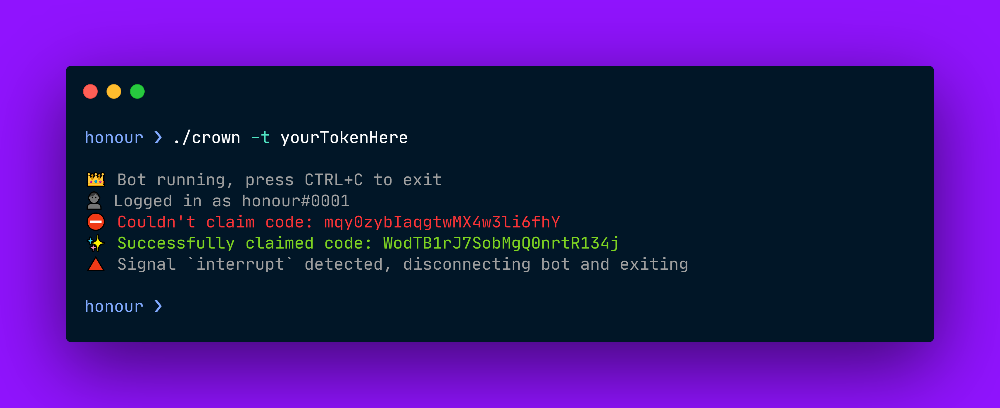

# Crown

A tiny sniper for Discord Nitro gift codes. Intended to be performant over well-featured.

**Automating user accounts on Discord is against their Terms of Service, and may result in your account being banned.**



## Usage

Ensure you have [go installed](https://golang.org/doc/install) before continuing.

You can build the application using the following command:

```
$ go build -o crown main.go
```

This will create an executable (`crown` on Unix systems and `crown.exe` on Windows) you can use to run the sniper.

You can run the sniper in one of two ways, explained below.

### Using a config file

Create a `config.toml` file in the same directory as the executable. Enter the following line:

```
Token = "yourTokenHere"
```

Then, you can run `./crown` without providing any arguments.

### Using a command-line argument

To use a command-line argument to run the sniper, use the `-t` flag:

```
$ ./crown -t yourTokenHere
```
